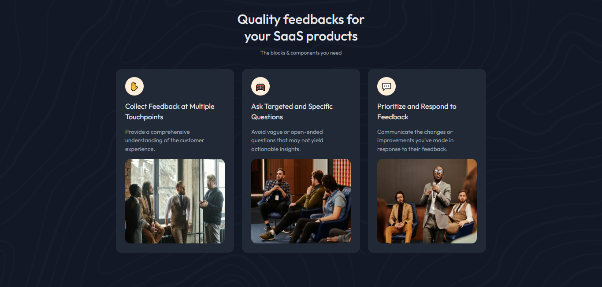

<h1 align="center">{Simple Feature Section} | devChallenges</h1>

   Solution for a challenge <a href="https://devchallenges.io/challenge/simple-feature-section-challenge" target="_blank">Simple Feature Section</a> from <a href="http://devchallenges.io" target="_blank">devChallenges.io</a>.

  <h3>
    <a href="{https://your-demo-link.your-domain}">
      Demo
    </a>
     | 
    <a href="{https://your-url-to-the-solution}">
      Solution
    </a>
     | 
    <a href="https://devchallenges.io/challenge/simple-feature-section-challenge">
      Challenge
    </a>
  </h3>

<!-- TABLE OF CONTENTS -->

## Table of Contents

- [Overview](#overview)
  - [What I learned](#what-i-learned)
  - [Useful resources](#useful-resources)
- [Built with](#built-with)
- [Contact](#contact)
- [Author](#author)

<!-- OVERVIEW -->

## Overview

### What I learned

I learnt how to maximise using css flexbox and css grid

### Useful resources

### Built with

- Semantic HTML5 markup
- CSS custom properties
- Flexbox
- CSS Grid

This application/site was created as a submission to a [DevChallenges](https://devchallenges.io/challenges-dashboard) challenge.

## Author

- Website [your-website.com](https://{your-web-site-link})
- GitHub [@your-username](https://{github.com/your-usermame})
